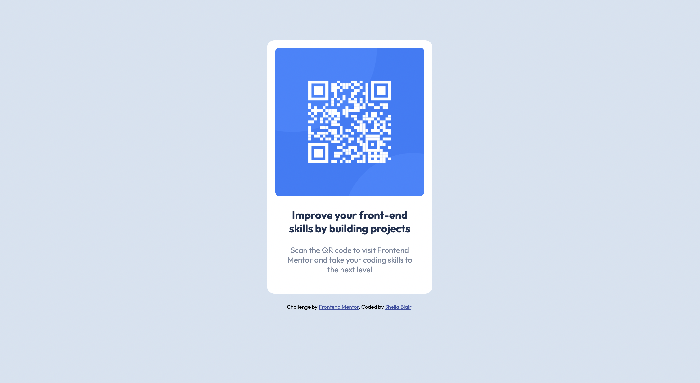

# Frontend Mentor - QR code component solution

This is a solution to the [QR code component challenge on Frontend Mentor](https://www.frontendmentor.io/challenges/qr-code-component-iux_sIO_H). Frontend Mentor challenges help you improve your coding skills by building realistic projects. 

## Table of contents

- [Overview](#overview)
  - [Screenshot](#screenshot)
  - [Links](#links)
- [My process](#my-process)
  - [Built with](#built-with)
  - [What I learned](#what-i-learned)
  - [Continued development](#continued-development)
- [Author](#author)

## Overview

This is my first challenge with Frontend Mentor. I used a mobile-first approach to build a QR code card for mobile, tablet, and desktop sites.

### Screenshot

### Links

- Solution URL: (https://github.com/sheblair/qr-code-component-main)
- Live Site URL: (https://sheblair.github.io/qr-code-component-main/)

## My process

I started by building out my html and adding in all the main elements I would need. Then I started building CSS, using a mobile-first workflow. I used Chrome DevTools liberally to make finetune adjustments as I was finishing up the project. Although the challenge only called for mobile and desktop sites, I found that I needed to add another media query for the tablet breakpoint, which ensures a smoothly responsive site at all screen sizes.

### Built with

- Semantic HTML5 markup
- CSS custom properties
- Flexbox
- CSS Grid
- Mobile-first workflow

### What I learned

1. One error that I started out with was using percentages instead of pixels in my border-radius property. For awhile I couldn't figure out why my rounded corners were looking so weird, and then I eventually figured that out and switched to pixels.

2. Another thing that I was pondering as I built this was wher or not to add a margin above the container div so that it would sit a little lower on the page in desktop view. I ended up decided to add some space, because I thought that it looked weird without that. I'm not sure if this was officially called for in the challenge or not.

### Continued development

My goal with working on this challenge was to get more practice using CSS flexbox to build responsive websites in a mobile-first workflow. I got some good practice and I'm ready to take on some more challenging builds!

## Author

- Website - [Sheila Blair](https://www.sheilablair.com)
- Frontend Mentor - [@sheblair](https://www.frontendmentor.io/profile/sheblair)