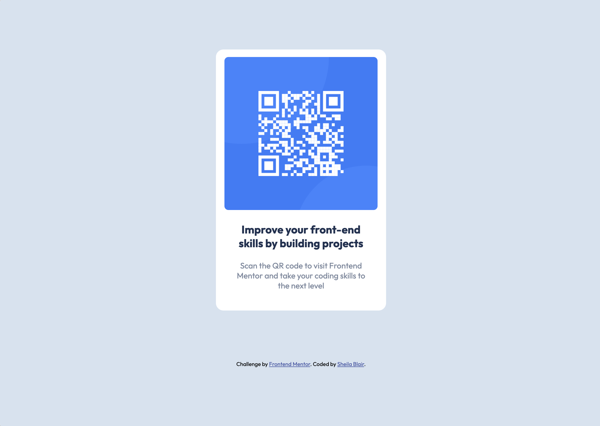

# Frontend Mentor - QR code component solution

This is a solution to the [QR code component challenge on Frontend Mentor](https://www.frontendmentor.io/challenges/qr-code-component-iux_sIO_H). Frontend Mentor challenges help you improve your coding skills by building realistic projects.

## Table of contents

- [Overview](#overview)
  - [Screenshot](#screenshot)
  - [Links](#links)
- [My process](#my-process)
  - [Built with](#built-with)
  - [What I learned](#what-i-learned)
  - [Continued development](#continued-development)
- [Author](#author)

## Overview

This was my first challenge with Frontend Mentor. I used a mobile-first approach to build a QR code card for mobile, tablet, and desktop sites.

### Screenshot

### Links

- [Solution](https://www.frontendmentor.io/solutions/qr-code-component-using-html-and-css-MZMomtq6ug)
- [Live Site](https://sheblair.github.io/qr-code-component)

## My process

I built a version of this component when I was very early in my journey learning HTML and CSS. About a year later, I came back to tweak it and found that I wanted to add better class names for my component, as well as change the way I was cascading styles from parent to child elements. I also wanted to change the way I was setting the margin for the component. Small changes but they were a strong reflection of how second-nature much of my CSS knowledge had become over just a year of practicing. Things that I had to think hard about when I first built this component had become obvious and intuitive to me.

### Built with

- Semantic HTML5
- CSS custom properties
- Flexbox
- Mobile-first workflow

### What I learned

1. One initial error was using percentages instead of pixels in my border-radius property. For awhile I couldn't figure out why my rounded corners were looking so weird, and then I eventually figured out that I needed to switch to pixels.

2. Another thing that I was wondering as I built this was whether or not to add a margin above the main container div so that it would sit a little lower on the page in desktop view, rather than flush at the top of the screen. I ended up deciding to add some space, because I thought it looked a little odd without. I'm not sure if there is a right answer here.

### Continued development

My goal with working on this challenge was to get more practice using CSS flexbox to build responsive websites and components in a mobile-first workflow. I got some good practice and I'm ready to take on some more challenging builds!

## Author

- [Sheila Blair](https://www.linkedin.com/in/sheblair/)
- [@sheblair](https://www.frontendmentor.io/profile/sheblair)
